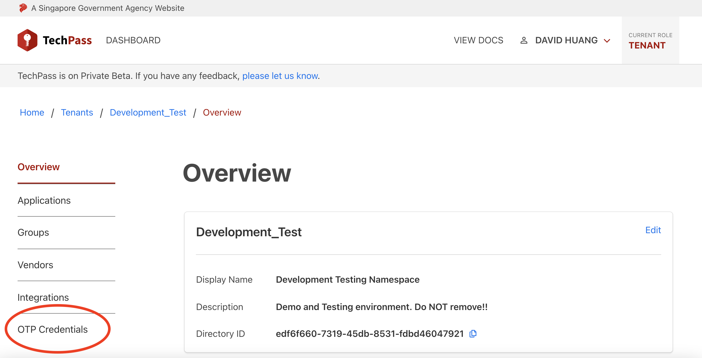
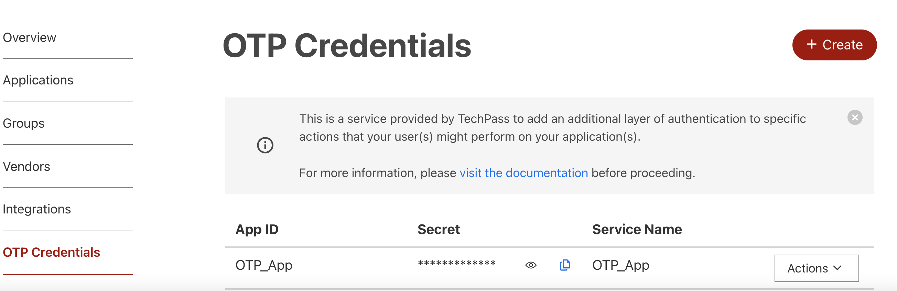
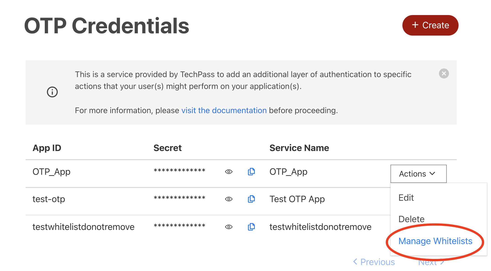
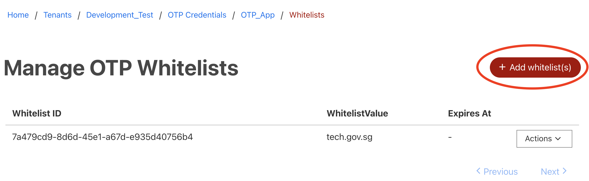
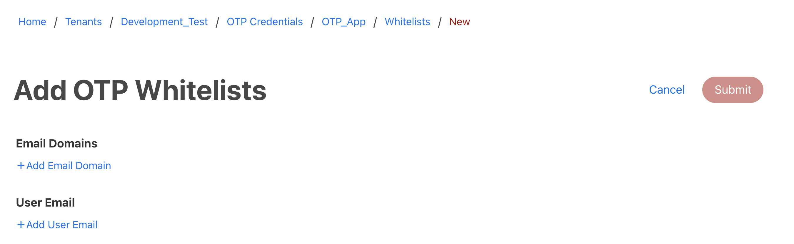
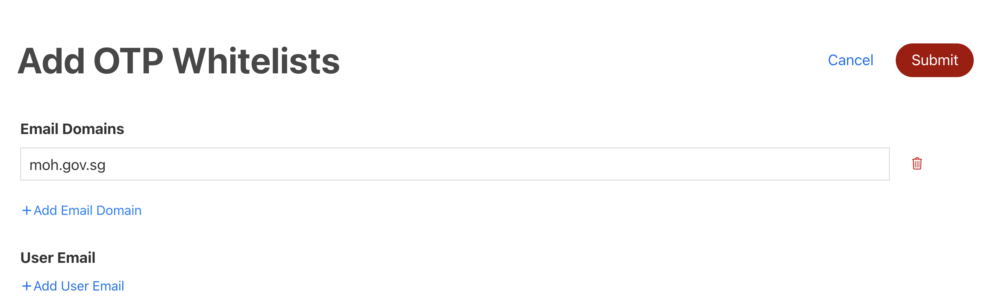
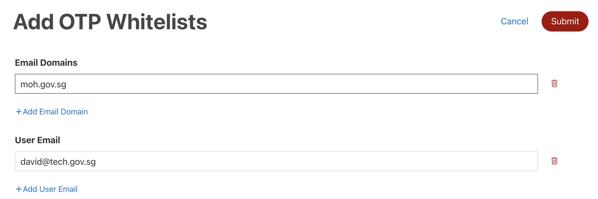
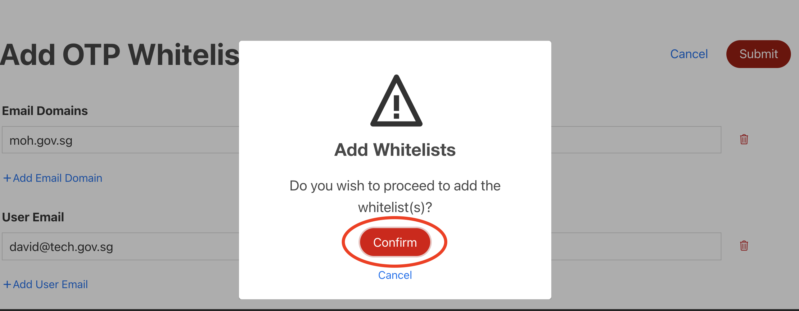
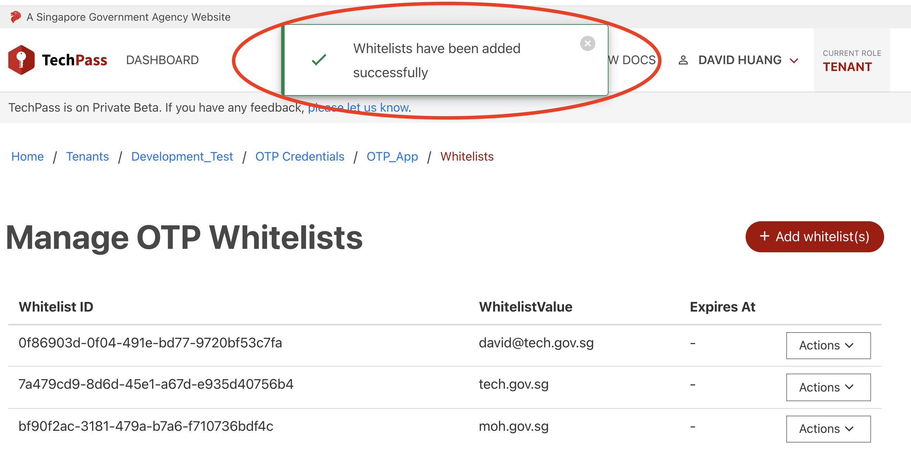

# Manage OTPaaS Whitelists

## Overview
This serves as a guide for managing OTP app whitelists via the TechPass portal. This allows tenants to restrict users that can use their services via OTPaaS.

## Getting Started
Make sure to have onboarded OTPaaS and created one or more OTP apps. More information about OTPaaS can be found [here](otpaas/otpaas.md).

## Viewing whitelists of OTP App
1. Make sure you have the `TENANT` role selected (on the top right on the navigation bar).

2. Go to your namespace. 
3. On the left side navigation bar, click on `OTP Credentials`.
   
   

   You should see your OTP app.

   

4. Hover over the `Actions` dropdown and select `Manage Whitelists`.

   

   You should see the table of whitelists of your OTP app.

   

## Add whitelists to OTP App
1. Make sure you are at the table of whitelists described in the **Viewing whitelists of OTP App** section.
2. Click the `+ Add whitelist(s)` button on the top right.

   

   You should see the form to add whitelists.

   

3. To add an email domain for whitelisting, click on `+Add Email Domain`. A field should popup to enter an email domain. 

   

4. You can add more email domains by repeating Step 3. You can remove any email domain by clicking on the bin icon found on the right of every email domain field.
5. To add an user email for whitelisting, click on `+Add User Email`. A field should popup to enter an user email.

   

6. You can add more user emails by repeating Step 5. You can remove any user email by clicking on the bin icon found on the right of every user email field.
7. Click on the `Submit` button on the top right. A confirmation prompt should appear asking to proceed with adding the whitelists. Click on `Confirm`.

   

   A notification should popup saying that the whitelists is successfully added.

   