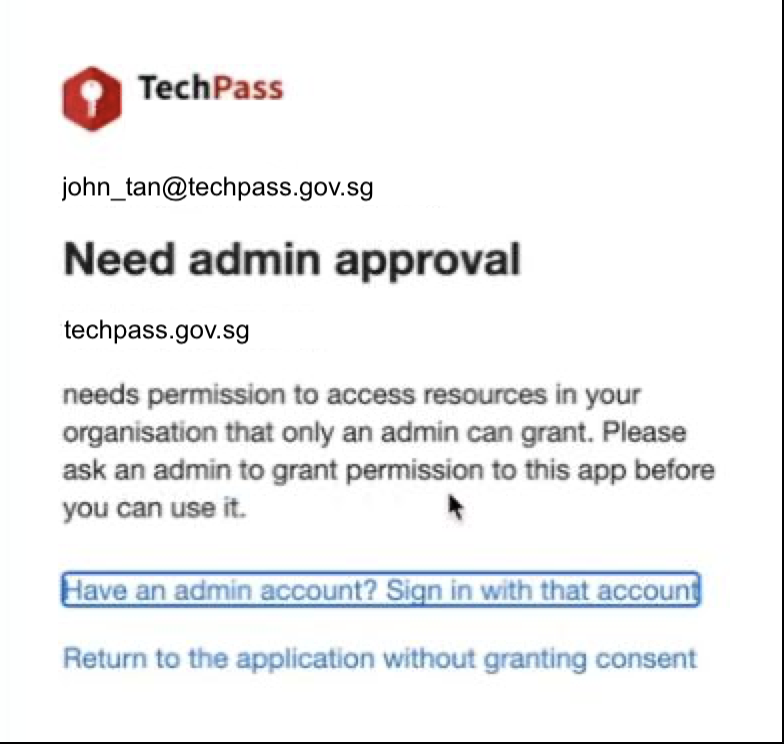

# Resources

## FAQ

## Integration

## Pre-requisites

## Glossary of Errors

### Need Admin Consent 
All applications created will require consent for default permissions from TechPass admins. 
Default permissions are the [OpenID Connect scopes](https://docs.microsoft.com/en-us/azure/active-directory/develop/v2-permissions-and-consent#openid-connect-scopes): openid, email, profile and offline_access.

Request for such consents are usually generated automatically when a new application is created. Our cloudops team will validate and provide the consent upon receiving this automatic request. The process usually takes 1-2 business days.

Consent was not given in the event you or your user receive the following prompt. You may contact us [here](https://go.gov.sg/techpass-sr) for resolution. 

ToDo: link to the page where users can input error code for more information on the error and the appropriate remediation actions.

## Engineering Suite

### TechPay

### TechBiz

### TechHelp
